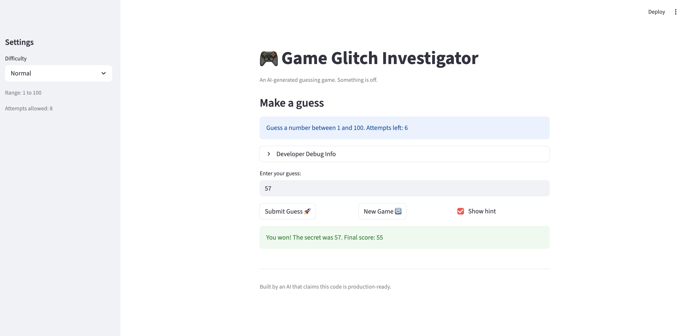

# 🎮 Game Glitch Investigator: The Impossible Guesser

## 🚨 The Situation

You asked an AI to build a simple "Number Guessing Game" using Streamlit.
It wrote the code, ran away, and now the game is unplayable. 

- You can't win.
- The hints lie to you.
- The secret number seems to have commitment issues.

## 🛠️ Setup

1. Install dependencies: `pip install -r requirements.txt`
2. Run the broken app: `python -m streamlit run app.py`

## 🕵️‍♂️ Your Mission

1. **Play the game.** Open the "Developer Debug Info" tab in the app to see the secret number. Try to win.
2. **Find the State Bug.** Why does the secret number change every time you click "Submit"? Ask ChatGPT: *"How do I keep a variable from resetting in Streamlit when I click a button?"*
3. **Fix the Logic.** The hints ("Higher/Lower") are wrong. Fix them.
4. **Refactor & Test.** - Move the logic into `logic_utils.py`.
   - Run `pytest` in your terminal.
   - Keep fixing until all tests pass!

## 📝 Document Your Experience

- [x] **Game purpose:** A number guessing game where the player picks a difficulty, gets a limited number of attempts to guess a secret number, and receives hints after each guess. The goal is to guess correctly before running out of attempts.

- [x] **Bugs found:**
  1. The "New Game" button did not actually start a new game — clicking it left the game in a won/lost state and blocked any new guesses.
  2. When hints were turned off, there was no feedback after each guess — the player had no idea how many attempts they had used until the very last one.
  3. The difficulty range was ignored — Easy mode was supposed to use 1–20 but the secret could be as high as 90.
  4. The hints were misleading — "Go HIGHER" meant the guess was too low, which felt backwards to read.
  5. The `logic_utils.py` functions were never implemented — all four stubs raised `NotImplementedError`, so the game only worked because the same functions were still defined in `app.py`.

- [x] **Fixes applied:**
  1. Fixed the New Game button by resetting `status` back to `"playing"`, clearing `history`, and generating the new secret using `get_range_for_difficulty(difficulty)`.
  2. Fixed the hints-off feedback by always showing an attempt count message after every non-winning guess, regardless of the hint setting.
  3. Implemented all four function stubs in `logic_utils.py` (`get_range_for_difficulty`, `parse_guess`, `check_guess`, `update_score`) and removed the duplicate definitions from `app.py`.
  4. Added two more helper functions to `logic_utils.py`: `get_attempt_limit_for_difficulty` (replacing the hardcoded attempt map in `app.py`) and `get_effective_secret` (encapsulating the intentional glitch behavior where the secret type switches on even attempts).
  5. Fixed the three original broken test assertions in `test_game_logic.py` that compared `check_guess` output to a plain string instead of unpacking the returned tuple.

## 📸 Demo

- [x] 

## 🚀 Stretch Features

- [ ] [If you choose to complete Challenge 4, insert a screenshot of your Enhanced Game UI here]
